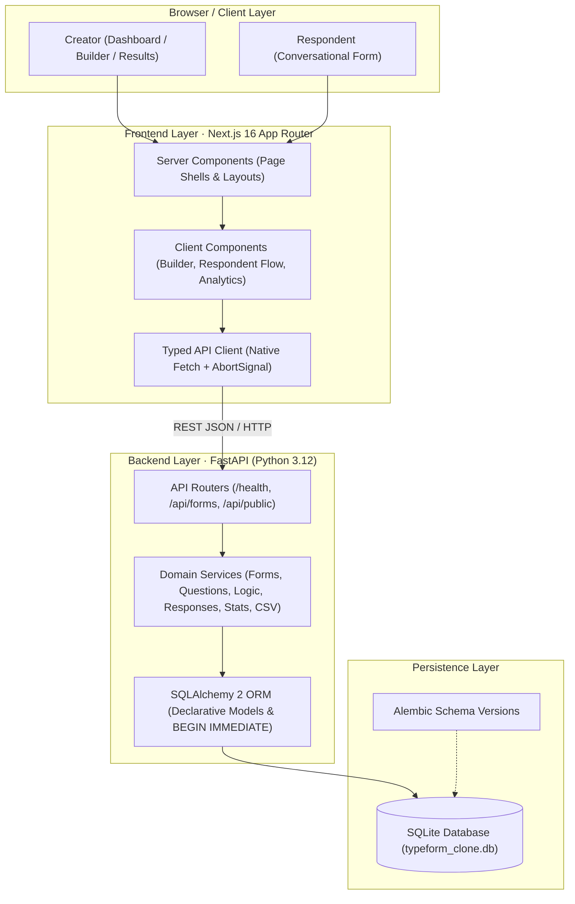
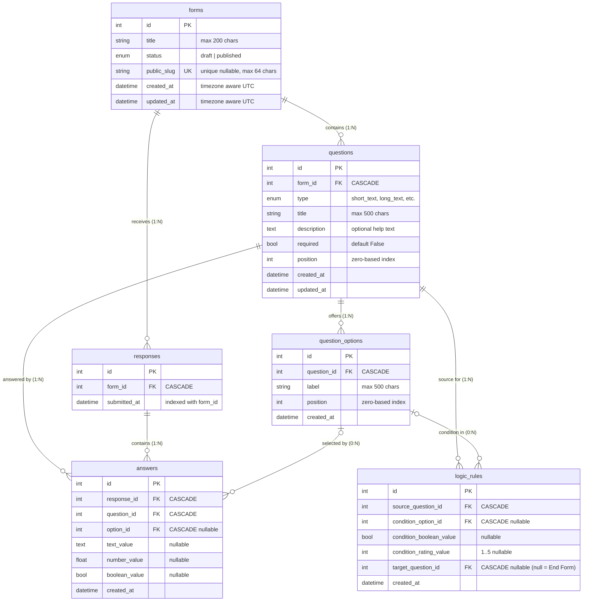

# Typeform Clone

A full-stack, conversational form builder and respondent application built for the **Scaler AI SDE Fullstack Assignment**. The project reproduces Typeform's signature one-question-at-a-time respondent experience alongside an administrative workspace, visual question builder, real-time preview, response analytics, conditional logic jumps, and CSV data export.

---

## Live Demo

- **Live Application URL:** [https://scaler-ai-typeform-clone.vercel.app]
- **GitHub Repository URL:** [https://github.com/Asceptic07/Scaler-AI-Typeform-Clone](https://github.com/Asceptic07/Scaler-AI-Typeform-Clone)

> [!NOTE]
> Production deployment is pending configuration on a host supporting persistent disk storage for SQLite. Follow the [Getting Started](#getting-started) guide below to run the complete stack locally.

---

## Screenshots / Preview

*Visual assets to capture and place in the repository before final submission:*

<!-- Recommended screenshots for repository presentation:
1. `docs/screenshots/dashboard.png` - Workspace dashboard showing form cards, response counts, search, and list/grid toggle.
2. `docs/screenshots/builder.png` - Visual form builder with question rail, center editing canvas, and settings sidebar.
3. `docs/screenshots/respondent.png` - Public conversational respondent view with progress indicator and keyboard hints.
4. `docs/screenshots/results.png` - Results dashboard with response list, distribution charts, and CSV download.
-->

| View | Description | Suggested Asset Path |
| --- | --- | --- |
| **Workspace Dashboard** | Form management grid/list, search, status badges, and action menus | `docs/screenshots/dashboard.png` |
| **Form Builder** | Three-column editor with drag-and-drop rail, editing canvas, and live preview | `docs/screenshots/builder.png` |
| **Public Respondent Flow** | Conversational full-screen question presentation with keyboard navigation | `docs/screenshots/respondent.png` |
| **Results & Analytics** | Submissions list, individual response viewer, aggregate statistics, and CSV export | `docs/screenshots/results.png` |

---

## Overview

Traditional web forms present respondents with long, fatigue-inducing static pages. This application implements a conversational UX paradigm:
- **One Question at a Time:** Respondents engage with questions sequentially in an immersive, full-screen viewport.
- **Fluid Keyboard Interaction:** Users can navigate forward, backward, select multiple-choice options, toggle booleans, and submit without lifting their fingers from the keyboard.
- **Relational Integrity:** Creators manage forms and view real-time statistics powered by a transactional SQLite backend that protects historical response data and enforces strict schema constraints.
- **Two-Tier Architecture:** Built with a Next.js 16 (App Router) TypeScript frontend and a high-performance Python FastAPI backend.

---

## Features

### Form Management & Workspace
- **Dashboard Overview:** View all forms with live response counts, published/draft status badges, and last modified timestamps.
- **Form Actions:** Create new drafts, rename titles, duplicate forms, and delete forms with confirmation modals.
- **Safe Duplication:** Duplicating a form copies all questions, options, and logic jump rules into a fresh draft, while omitting public slugs and collected responses.
- **Search & Sort:** Real-time client-side search filtering by title, with sorting by creation date, update date, or alphabetical title.
- **View Toggle:** Switch seamlessly between responsive card grid and compact list views.

### Form Builder & Editor
- **Three-Column Layout:** Left question navigation rail, center editing canvas with interactive answer visualizers, and right-hand settings drawer.
- **Drag-and-Drop Reordering:** Reorder questions via pointer drag-and-drop or accessible keyboard controls (`Space` to grab, `Arrow` keys to reposition, `Space` to drop) powered by `@dnd-kit`.
- **Inline Editing:** Edit question titles and descriptions/help text with auto-save on blur; toggle required status and mutate choice options with immediate API synchronization.
- **Live Preview:** Switch between desktop and mobile preview frames directly within the builder to test respondent flow without recording test responses.
- **Publishing Lifecycle:** Publish forms with one click to generate a cryptographically stable public slug (`token_urlsafe`); unpublish anytime to revert to draft.
- **Historical Data Protection:** Published forms and forms that have collected responses lock question definitions against destructive mutations to safeguard stored answers.

### Respondent Experience
- **Conversational Presentation:** Full-screen layout displaying exactly one active question at a time.
- **Smooth Animated Transitions:** Forward and backward sliding transitions powered by Framer Motion, with automatic compliance for `prefers-reduced-motion`.
- **Progress Tracking:** Dynamic progress indicator displaying the current step index and overall percentage completion.
- **Keyboard-First Navigation:** Press `Enter` to advance, `ArrowUp` to return to previous questions, `ArrowDown` to step forward, letter keys (`A`–`Z`) for multiple choice, `Y`/`N` for booleans, and `1`–`5` for ratings.
- **Input Isolation:** Enter and arrow keys are preserved inside `<textarea>` elements and native `<select>` dropdowns to prevent accidental navigation during multiline typing.
- **Confirmed Thank-You Screen:** Interactive completion screen with focus management confirming successful persistence in SQLite.

### Responses & Analytics
- **Submissions List:** View all responses ordered newest-first with browser-local timestamps.
- **Individual Response Drill-Down:** Dedicated route (`/forms/[formId]/results/[responseId]`) displaying full response details, including selected option labels, text answers, and explicit "Not answered" markers for skipped optional questions.
- **Aggregate Statistics:** Per-question answered counts, percentage distributions with visual progress bars for choice/dropdown/boolean/rating types, and calculated arithmetic averages for rating scales.
- **Zero-State Safety:** Empty answer sets and unpopulated questions display graceful 0% states without `NaN` errors or incorrect averages.

### Validation & Persistence
- **Client-Side Validation:** Instant input verification for required fields, email syntax, numeric bounds, character limits, and rating scale constraints.
- **Server-Side Enforcement:** FastAPI schemas validate data integrity using Pydantic and `email-validator`; rejects invalid formats with HTTP 422.
- **Error Recovery:** On submission failure or validation rejection, the respondent UI preserves all entered inputs, navigates back to the first invalid question, and focuses the field with error messaging.
- **Relational Consistency:** SQLite foreign keys with cascading deletions ensure orphan records are never created when questions, options, or forms are deleted.

### UX & Accessibility
- **Accessible Modals:** Native accessible dialogs with focus trapping, `Escape` key dismissal, and backdrop click handling.
- **Toast Notifications:** Immediate feedback for publish, unpublish, save, duplication, and clipboard actions via Sonner.
- **Focus Management:** Visible focus rings and programmatic focus restoration across modal dismissals and question transitions.

### Bonus Features Implemented
- **Conditional Logic Jumps:** Configure equality rules on Multiple Choice, Dropdown, Yes/No, and Rating questions to jump to a specific downstream question or immediately "End form".
  - *Dynamic Path Resolution:* The respondent interface computes the active branch dynamically; modifying an earlier answer automatically prunes invalid downstream branch data.
  - *Server-Side Path Verification:* The backend re-evaluates the active branching path upon submission, ignoring skipped questions (even if marked required).
  - *Safety Constraints:* Rules only allow forward-pointing targets; reordering questions that would create backward loops is rejected with HTTP 422.
- **CSV Response Export:** Export form submissions to structured CSV (`/api/forms/{formId}/responses/export.csv`) featuring ISO 8601 UTC timestamps, resolved option labels, and spreadsheet formula injection sanitization (`=`, `+`, `-`, `@`).
- **Dark Mode:** System-aware theme toggle with persistent storage in `localStorage` and pre-paint head injection to eliminate theme flickering.

---

## Question Types

All eight required question types are fully implemented across the builder, respondent flow, server validation, database persistence, and analytics:

| Question Type | Supported | Input Behavior & Constraints | Analytics / Results View |
| --- | :---: | --- | --- |
| **Short Text** | Yes | Single-line text input; max 1,000 characters | Raw text answer display |
| **Long Text** | Yes | Multiline textarea; preserves line breaks; max 20,000 characters | Raw text with preserved line breaks |
| **Multiple Choice** | Yes | Custom single-select options; keyboard shortcuts (`A`, `B`, `C`, etc.); supports logic jumps | Option label display; count & percentage distribution bar |
| **Dropdown** | Yes | Native `<select>` picker with keyboard navigation; supports logic jumps | Option label display; count & percentage distribution bar |
| **Email** | Yes | Format validation via regex (client) and `email-validator` (server); max 254 chars | Normalized email address display |
| **Number** | Yes | Finite numeric input; integer range constraint $(-2^{53} \text{ to } 2^{53})$ | Numeric value display |
| **Yes / No** | Yes | Boolean toggle; keyboard shortcuts (`Y` / `N`); supports logic jumps | "Yes" / "No" display; count & percentage distribution bar |
| **Rating** | Yes | Fixed 1–5 star/button scale; keyboard shortcuts (`1`–`5`); supports logic jumps | Star rating display; distribution bar; calculated arithmetic average |

---

## Tech Stack

### Frontend

| Technology | Version / Specification | Purpose |
| --- | --- | --- |
| **Next.js** | `16.3.8` (App Router, Turbopack) | React framework for server and client components |
| **React / React DOM** | `19.2.8` | UI rendering engine |
| **TypeScript** | `5.x` | Static type safety across routes, types, and API contracts |
| **Tailwind CSS** | `4.x` (`@tailwindcss/postcss`) | Utility styling paired with custom component CSS |
| **@dnd-kit/core** | `6.3.1` | Drag-and-drop pointer and keyboard sensor orchestration |
| **@dnd-kit/sortable** | `10.0.0` | Vertical sortable question list strategy |
| **Framer Motion** | `14.0.0` | Fluid slide transitions with reduced-motion support |
| **Lucide React** | `1.52.0` | Accessible vector interface iconography |
| **Sonner** | `2.0.8` | Toast notification management |
| **clsx / tailwind-merge** | `2.1.1` / `3.7.0` | Conditional CSS class composition |
| **Zod** | `4.6.5` | Client-side schema verification utility |

### Backend

| Technology | Version / Specification | Purpose |
| --- | --- | --- |
| **Python** | `3.12` | Runtime environment |
| **FastAPI** | `0.142.2` | High-performance asynchronous REST API framework |
| **Uvicorn** | `0.54.0` (standard) | ASGI web server |
| **SQLAlchemy** | `2.1.3` | Relational ORM with transactional sessions |
| **Alembic** | `1.20.0` | Database schema migrations |
| **SQLite 3** | Built-in | Relational database with foreign keys and immediate write locking |
| **Pydantic** | `2.x` | Request/response data validation and serialization |
| **pydantic-settings**| `2.15.0` | Environment configuration management |
| **email-validator** | `2.3.0` | RFC-compliant email deliverability and syntax validation |
| **pytest** | `9.1.1` | Comprehensive backend test runner (107 tests) |
| **Ruff** | `0.16.10` | Fast Python linter and code formatter |
| **uv** | `0.10.6` | Fast Python package and environment manager |

---

## Architecture

The application adopts a decoupled full-stack architecture. The Next.js frontend handles page routing and user interactions via lightweight client components, while the FastAPI backend enforces validation, executes business rules, and manages SQLite persistence.



### Architectural Principles
1. **Zero External State Stores:** State management relies on idiomatic React component state and URL routes. No heavy global state libraries (Redux, Zustand) or HTTP query caches are needed.
2. **Native Fetch with Bounded Timeouts:** The client API layer uses native `fetch` combined with `AbortSignal.any([signal, AbortSignal.timeout(10000)])` for deterministic 10-second timeout handling and graceful error messages.
3. **Transaction Safety:** SQLite connections strictly enforce foreign keys (`PRAGMA foreign_keys = ON`). Mutating endpoints acquire `BEGIN IMMEDIATE` locks to prevent write-concurrency races during publishing and submission.
4. **Isolated Path Validation:** In conversational branching forms, the server re-evaluates the active question path during submission, ensuring skipped branches are never persisted and required validation is only enforced on questions actually visited.

---

## Project Structure

```text
Scaler-AI-Assignment/
├── frontend/                       # Next.js 16 App Router frontend
│   ├── public/                     # Static assets & font license notices
│   ├── src/
│   │   ├── app/                    # Next.js routes & root layout
│   │   │   ├── forms/[formId]/     # Builder & results pages
│   │   │   │   ├── results/        # Submissions list & summary view
│   │   │   │   │   └── [responseId]/ # Single response detail page
│   │   │   ├── to/[slug]/          # Conversational public respondent flow
│   │   │   ├── globals.css         # Global variables & theme styles
│   │   │   ├── layout.tsx          # Root HTML layout with theme script
│   │   │   └── page.tsx            # Creator workspace dashboard
│   │   ├── components/ui/          # Reusable accessible UI components
│   │   │   ├── button.tsx          # Standard button component
│   │   │   ├── modal.tsx           # Accessible dialog modal
│   │   │   ├── menu.tsx            # Dropdown menu component
│   │   │   └── appearance-toggle.tsx # Dark mode switcher
│   │   ├── features/               # Modular domain feature implementations
│   │   │   ├── forms/              # Dashboard grid/list & management dialogs
│   │   │   ├── builder/            # Question rail, canvas, settings & preview
│   │   │   ├── respondent/         # One-at-a-time runner, navigation & checks
│   │   │   └── results/            # Analytics summary & response cards
│   │   ├── lib/
│   │   │   ├── api/                # Typed fetch helpers (forms, questions, etc.)
│   │   │   ├── logic.ts            # Client-side branching & path resolution
│   │   │   └── appearance.ts       # Theme state & event emitter
│   │   └── types/                  # TypeScript interface declarations
│   ├── tests/                      # Frontend unit tests
│   │   └── logic.test.mjs          # Conditional logic path tests
│   ├── package.json
│   └── tsconfig.json
├── backend/                        # FastAPI Python 3.12 backend
│   ├── alembic/                    # Schema migrations
│   │   └── versions/               # Version scripts (e42a53e64a4a, b7c91d2e4a60)
│   ├── app/
│   │   ├── api/                    # Central router & DB session dependencies
│   │   ├── core/                   # Pydantic settings & config resolution
│   │   ├── db/                     # Declarative Base, engine & idempotent seed
│   │   │   └── seed.py             # Sample forms & responses generator
│   │   ├── models/                 # SQLAlchemy 2 relational models
│   │   │   ├── form.py             # Forms table
│   │   │   ├── question.py         # Questions & QuestionOptions tables
│   │   │   ├── logic_rule.py       # LogicRules table
│   │   │   ├── response.py         # Responses table
│   │   │   └── answer.py           # Answers table
│   │   ├── routes/                 # FastAPI HTTP route handlers
│   │   │   ├── forms.py            # Form CRUD, questions, results, CSV
│   │   │   ├── public.py           # Public form definition & submission
│   │   │   └── health.py           # Health probe endpoint
│   │   ├── schemas/                # Pydantic request & response models
│   │   ├── services/               # Core business logic & validations
│   │   │   ├── form_service.py     # Publishing & duplication logic
│   │   │   ├── question_service.py # Question mutations & order compaction
│   │   │   ├── logic_service.py    # Logic validation & evaluation
│   │   │   ├── response_service.py # Submission validation & serialization
│   │   │   ├── statistics_service.py # Distribution aggregations
│   │   │   └── csv_export_service.py # CSV serialization & formula escaping
│   │   └── main.py                 # FastAPI application factory & CORS setup
│   ├── tests/                      # Backend pytest test suite (107 tests)
│   ├── pyproject.toml              # Dependencies & Ruff/pytest configs
│   └── uv.lock                     # Locked backend dependencies
├── docs/                           # Documentation & QA audit reports
│   └── QA.md                       # Comprehensive requirement audit report
└── README.md                       # Project documentation
```

---

## Database Design

The database schema is implemented with SQLAlchemy 2 declarative models and managed via Alembic migrations on SQLite. Foreign key enforcement is active on every connection, and deletions cascade to dependent rows.



### Table Details & Constraints

1. **`forms`**
   - **Primary Key:** `id`
   - **Constraints:** `ck_forms_title` (`length(trim(title)) > 0`), `ck_forms_published_slug` (`status != 'published' OR public_slug IS NOT NULL`).
   - **Indexes:** Index on `status`, Unique index on `public_slug`.

2. **`questions`**
   - **Primary Key:** `id`
   - **Foreign Keys:** `form_id` $\rightarrow$ `forms.id` (`ON DELETE CASCADE`).
   - **Constraints:** `uq_questions_form_position` (`UNIQUE(form_id, position)`), `ck_questions_position` (`position >= 0`), `ck_questions_title` (`length(trim(title)) > 0`).

3. **`question_options`**
   - **Primary Key:** `id`
   - **Foreign Keys:** `question_id` $\rightarrow$ `questions.id` (`ON DELETE CASCADE`).
   - **Constraints:** `uq_options_question_position` (`UNIQUE(question_id, position)`), `ck_options_position` (`position >= 0`), `ck_options_label` (`length(trim(label)) > 0`).

4. **`logic_rules`**
   - **Primary Key:** `id`
   - **Foreign Keys:** `source_question_id` $\rightarrow$ `questions.id` (`ON DELETE CASCADE`), `condition_option_id` $\rightarrow$ `question_options.id` (`ON DELETE CASCADE`), `target_question_id` $\rightarrow$ `questions.id` (`ON DELETE CASCADE`).
   - **Constraints:** `ck_logic_one_condition` (exactly one condition value must be set), `ck_logic_rating` (`condition_rating_value BETWEEN 1 AND 5`), unique constraints ensuring one rule per condition value per source question.

5. **`responses`**
   - **Primary Key:** `id`
   - **Foreign Keys:** `form_id` $\rightarrow$ `forms.id` (`ON DELETE CASCADE`).
   - **Indexes:** Composite index `ix_responses_form_submitted` on `(form_id, submitted_at, id)` for optimized newest-first query performance.

6. **`answers`**
   - **Primary Key:** `id`
   - **Foreign Keys:** `response_id` $\rightarrow$ `responses.id` (`ON DELETE CASCADE`), `question_id` $\rightarrow$ `questions.id` (`ON DELETE CASCADE`), `option_id` $\rightarrow$ `question_options.id` (`ON DELETE CASCADE`).
   - **Constraints:** `uq_answers_response_question` (`UNIQUE(response_id, question_id)`), `ck_answers_one_value` (strictly one value column—`text_value`, `number_value`, `boolean_value`, or `option_id`—is non-null).

---

## API Overview

The FastAPI backend exposes typed REST endpoints documented interactively via Swagger UI at `/docs`.

### Health Check

| Method | Endpoint | Description | Status Codes |
| --- | --- | --- | --- |
| `GET` | `/health` | Service health probe returning status and application name | `200` |

### Form Management & Publishing

| Method | Endpoint | Description | Status Codes |
| --- | --- | --- | --- |
| `GET` | `/api/forms` | List all forms with aggregated response counts | `200` |
| `POST` | `/api/forms` | Create a new draft form | `201`, `422` |
| `GET` | `/api/forms/{id}` | Get full form definition with questions, options, and logic | `200`, `404` |
| `PATCH` | `/api/forms/{id}` | Rename a form | `200`, `404`, `422` |
| `DELETE` | `/api/forms/{id}` | Delete a form and cascade delete questions, responses, and answers | `204`, `404` |
| `POST` | `/api/forms/{id}/duplicate` | Create a draft duplicate without public slug or responses | `201`, `404` |
| `POST` | `/api/forms/{id}/publish` | Publish form and allocate a stable public slug | `200`, `400`, `404` |
| `POST` | `/api/forms/{id}/unpublish` | Revert published form to draft while retaining slug | `200`, `404` |

### Questions & Ordering

| Method | Endpoint | Description | Status Codes |
| --- | --- | --- | --- |
| `POST` | `/api/forms/{id}/questions` | Append a question to an editable form | `201`, `404`, `409`, `422` |
| `PATCH` | `/api/forms/{id}/questions/{qId}` | Update question title, description, required flag, type, or options | `200`, `404`, `409`, `422` |
| `DELETE` | `/api/forms/{id}/questions/{qId}` | Delete question and compact remaining positions | `204`, `404`, `409` |
| `PUT` | `/api/forms/{id}/questions/reorder` | Persist full question ordering transactionally | `200`, `404`, `409`, `422` |

### Conditional Logic

| Method | Endpoint | Description | Status Codes |
| --- | --- | --- | --- |
| `PUT` | `/api/forms/{id}/questions/{qId}/logic` | Atomically replace equality logic rules for a question | `200`, `404`, `409`, `422` |

### Public Respondent Endpoints

| Method | Endpoint | Description | Status Codes |
| --- | --- | --- | --- |
| `GET` | `/api/public/forms/{slug}` | Retrieve published form structure for respondents | `200`, `404` |
| `POST` | `/api/public/forms/{slug}/responses` | Atomically validate and persist a complete respondent submission | `201`, `404`, `422` |

### Results, Analytics & Export

| Method | Endpoint | Description | Status Codes |
| --- | --- | --- | --- |
| `GET` | `/api/forms/{id}/responses` | List responses newest-first with answer summaries | `200`, `404` |
| `GET` | `/api/forms/{id}/responses/{rId}` | Retrieve a single response with full answers and option labels | `200`, `404` |
| `GET` | `/api/forms/{id}/responses/export.csv` | Download responses as an RFC 4180 CSV file | `200`, `404` |
| `GET` | `/api/forms/{id}/statistics` | Get response count and per-question distributions/averages | `200`, `404` |

---

## Getting Started

### Prerequisites

Ensure you have the following installed on your machine:
- **Node.js:** `v24.x` (or `v20.x` LTS minimum)
- **npm:** `v10.x` or higher
- **Python:** `3.12.x`
- **uv:** `0.10.x` or higher *(recommended for Python dependency management)* or standard `python3` / `venv` / `pip`

---

### 1. Clone Repository

```sh
git clone https://github.com/Asceptic07/Scaler-AI-Typeform-Clone.git
cd Scaler-AI-Typeform-Clone
```

---

### 2. Backend Setup

Open a terminal and navigate to the `backend/` directory:

```sh
cd backend
```

#### Option A: Using `uv` (Recommended)

`uv` automatically provisions the virtual environment defined in `.python-version`:

```sh
# 1. Install locked dependencies
uv sync

# 2. Run database migrations to head revision
uv run alembic upgrade head

# 3. Seed sample published forms and responses
uv run python -m app.db.seed

# 4. Start the FastAPI development server
uv run uvicorn app.main:app --reload --port 8000
```

#### Option B: Using Standard Python `venv` & `pip`

```sh
# 1. Create and activate a virtual environment
python -m venv .venv

# On macOS / Linux:
source .venv/bin/activate

# On Windows (PowerShell):
.venv\Scripts\Activate.ps1

# On Windows (Command Prompt):
.venv\Scripts\activate.bat

# 2. Install project dependencies
pip install -e .

# 3. Run database migrations
alembic upgrade head

# 4. Seed sample data
python -m app.db.seed

# 5. Start the FastAPI server
uvicorn app.main:app --reload --port 8000
```

The backend API will be running at `http://localhost:8000`.

---

### 3. Frontend Setup

In a separate terminal, navigate to the `frontend/` directory:

```sh
cd frontend

# 1. Install npm dependencies
npm install

# 2. Start the Next.js development server
npm run dev
```

The frontend will be running at `http://localhost:3000`.

---

### 4. Open the Application

| Service | Local Address | Description |
| --- | --- | --- |
| **Creator Workspace** | `http://localhost:3000` | Dashboard, form builder, and results views |
| **Sample Form 1** | `http://localhost:3000/to/sample-product-feedback` | Seeded public product feedback form |
| **Sample Form 2** | `http://localhost:3000/to/sample-event-survey` | Seeded public event survey form |
| **Backend Health** | `http://localhost:8000/health` | API service health check |
| **API Documentation** | `http://localhost:8000/docs` | Interactive Swagger UI API documentation |

---

## Environment Variables

Both frontend and backend include pre-configured `.env.example` template files. Default settings work out-of-the-box for local development.

### Backend (`backend/.env`)

Copy `backend/.env.example` to `backend/.env` if customizing defaults:

| Variable | Default Value | Purpose |
| --- | --- | --- |
| `APP_NAME` | `Typeform Clone API` | Service name returned in `/health` and OpenAPI title |
| `APP_ENV` | `development` | Environment label (`development` / `production`) |
| `DATABASE_URL` | `sqlite:///./typeform_clone.db` | SQLAlchemy SQLite connection string (resolves relative to `backend/`) |
| `FRONTEND_ORIGIN` | `http://localhost:3000` | Allowed browser origin for CORS (must match frontend exactly) |

### Frontend (`frontend/.env.local`)

Copy `frontend/.env.example` to `frontend/.env.local` if customizing defaults:

| Variable | Default Value | Purpose |
| --- | --- | --- |
| `NEXT_PUBLIC_API_URL` | `http://localhost:8000` | Base URL of the FastAPI backend for browser requests |

> [!IMPORTANT]
> `NEXT_PUBLIC_API_URL` is baked into client bundles at build time. When deploying to production, this variable must be set **before** executing `npm run build`.

---

## Database / Seed Data

- **Database Engine:** SQLite 3 with foreign key enforcement enabled via connection events.
- **Location:** The database file is located at `backend/typeform_clone.db` (git-ignored to ensure clean clones).
- **Migrations:** Managed via Alembic. The latest schema revision is `b7c91d2e4a60` (`add_logic_rules`).
- **Seed Command:** `uv run python -m app.db.seed` (or `python -m app.db.seed`).
- **Idempotency:** The seed script checks for existing slugs before insertion. Running the script multiple times will never duplicate forms or overwrite existing responses.

### Seeded Forms & Data

The seed command creates two complete published forms containing all eight question types and six submitted responses:

1. **Product Feedback (`slug: sample-product-feedback`)**
   - Question 1: Short Text — *"What is your name?"*
   - Question 2: Email — *"What is your email address?"*
   - Question 3: Multiple Choice — *"Which plan do you prefer?"* (Choices: Basic, Pro, Business)
   - Question 4: Rating — *"How would you rate your experience?"* (Scale 1–5)
   - Seeded with 3 completed respondent submissions.

2. **Event Survey (`slug: sample-event-survey`)**
   - Question 1: Long Text — *"What should we improve?"*
   - Question 2: Dropdown — *"Which session did you attend?"* (Choices: Design, Engineering, Product)
   - Question 3: Number — *"How many events have you attended?"*
   - Question 4: Yes / No — *"Would you attend again?"* (Choices: Yes, No)
   - Seeded with 3 completed respondent submissions.

---

## Validation

### Client-Side Validation (`validation.ts`)
- **Required Fields:** Ensures non-empty input before the respondent can advance or submit.
- **Email Validation:** Evaluates address format with an RFC-compliant regex pattern; enforces maximum length of 254 characters.
- **Numeric Validation:** Validates finite numeric input, rejects non-numeric characters, and checks against precision overflow beyond standard JavaScript integer limits $(-2^{53} \text{ to } 2^{53})$.
- **Text Length Bounds:** Enforces limits of 1,000 characters for Short Text and 20,000 characters for Long Text.
- **Choice Verification:** Verifies selected option IDs exist within the question's defined options list.
- **Rating Constraints:** Rejects values outside the 1–5 integer range.

### Server-Side Validation (`response_service.py`)
- **Normalized Email Check:** Validates email syntax using `email-validator` in normalized form.
- **Strict Type Verification:** Validates incoming JSON types; rejects malformed values with HTTP 422.
- **Path Reachability Check:** The server independently reconstructs the respondent's branching path. Any stale answers submitted from skipped branches are stripped before database insertion.
- **Atomic Transaction Rollback:** The entire response submission is wrapped in a single database transaction. If any answer fails validation, zero answers or responses are recorded.

---

## Keyboard & Respondent UX

The respondent flow replicates the fluid keyboard-driven interaction popularized by Typeform:

- **Advance / Next Question:** Press `Enter` on any single-line input or choice selection to advance.
- **Previous Question:** Press `ArrowUp` to navigate back to the previous question.
- **Next Question:** Press `ArrowDown` to step forward along the visited path.
- **Choice Shortcuts:**
  - Multiple Choice: Press `A`, `B`, `C`, etc. to select the corresponding lettered option.
  - Yes / No: Press `Y` for Yes or `N` for No.
  - Rating: Press keys `1` through `5` to select a rating.
- **Input Isolation:** Enter and Arrow keys retain their default behavior inside multiline `<textarea>` fields and native `<select>` dropdowns so respondents can type line breaks or pick dropdown items naturally.
- **Progress Counter:** The footer displays current question index (`Question X of Y`) and a animated progress bar.
- **Focus Management:** On transition, autofocus is applied to the active input element. On validation errors, focus automatically returns to the offending question.

---

## Deployment

The application consists of a decoupled frontend and backend. Because SQLite is utilized as the database, specific hosting considerations apply.

### Frontend Deployment (Vercel / Node Host)
1. Point your host to the `frontend/` directory.
2. Build command: `npm run build`
3. Output directory: `.next`
4. Environment variable: Set `NEXT_PUBLIC_API_URL` to your hosted backend origin (e.g., `https://api.yourdomain.com`) **prior to building**.
5. Start command for self-hosted Node: `npm run start`

### Backend Deployment & Durable SQLite Storage
FastAPI can be hosted on platforms such as Render, Railway, Fly.io, or any virtual machine (EC2 / DigitalOcean).

> [!CAUTION]
> **SQLite Ephemeral Storage Consideration:** Most serverless platforms and free container tiers provide ephemeral filesystems. Restarts or redeployments will wipe an unmounted SQLite database.
> 
> For production SQLite persistence:
> 1. Attach a **persistent volume / disk** (e.g., mounted at `/var/data`).
> 2. Set `DATABASE_URL=sqlite:////var/data/typeform_clone.db`.
> 3. Set `FRONTEND_ORIGIN` to the exact HTTPS origin of your deployed frontend to satisfy CORS.
> 4. Chain migrations, seed, and startup in your service start command so failed migrations prevent application boot:
>    ```sh
>    alembic upgrade head && python -m app.db.seed && uvicorn app.main:app --host 0.0.0.0 --port "$PORT"
>    ```

---

## Third-Party Libraries & Licenses

This project was built from scratch as an original implementation. **No Typeform source code, CSS, proprietary icons, or paid assets were copied or used.** Public documentation was consulted solely as a functional reference for user experience expectations.

All third-party dependencies are open-source and permissible:

| Dependency / Resource | License | Notice / Reference |
| --- | --- | --- |
| Next.js, React, React DOM, Tailwind CSS | MIT | Standard open-source distributions |
| dnd-kit (`@dnd-kit/core`, `@dnd-kit/sortable`) | MIT | Drag-and-drop toolkit |
| Framer Motion | MIT | Motion and transition library |
| Lucide React | ISC / MIT | Open-source icon system |
| Sonner | MIT | Toast notification system |
| FastAPI, SQLAlchemy, Pydantic, Alembic | MIT | Python backend ecosystem |
| Uvicorn, httpx | BSD-3-Clause | ASGI server & HTTP testing library |
| email-validator | Unlicense | Email validation utility |
| SQLite | Public Domain | Embedded relational database engine |
| Geist Font | SIL Open Font License 1.1 | Notice bundled at `frontend/public/licenses/geist-OFL.txt` |

---

## Assumptions

1. **Single-Creator Evaluation Scope:** The assignment intentionally omits authentication. The admin workspace assumes a single default creator; form management and results endpoints require no creator login.
2. **Public Unauthenticated Respondents:** Anyone with a form's public link can submit responses without creating an account or logging in.
3. **Single Choice Selection:** Multiple Choice and Dropdown questions permit one selection per answer.
4. **Fixed Rating Range:** Rating questions use a fixed 1 to 5 numerical scale.
5. **Form Edit Locking:** Published forms and forms that have received submissions lock question mutations to prevent invalidating or corrupting historical answer records. Creators can unpublish an unanswered form to edit it, or duplicate a form to branch it.
6. **Completed Submissions Only:** Only complete, submitted responses are persisted to SQLite. Unsubmitted responses are not stored as partial drafts.

---

## Known Limitations

- **No Creator Authentication:** There is no user login, multi-tenant workspace isolation, or role-based access control.
- **Forward-Only Logic Jumps:** Branching logic supports strict forward jumps and "End Form" actions. Cyclic loops, complex nested boolean expressions (`AND`/`OR`), and backward jumps are intentionally not supported.
- **Unpaginated Response Views:** Response list views fetch all submissions for a given form; there is no server-side pagination for high-volume datasets.
- **Settings Customization Placeholders:** The Theme and Thank-You customization sections in the builder settings modal are marked with "Coming soon" placeholders and do not persist custom styles.
- **Single-Writer Concurrency:** SQLite serializes write operations via database-level locking. High-concurrency write workloads require migration to PostgreSQL.

---

## Future Improvements

- **Multi-Tenant Authentication:** User accounts, workspaces, and role-based permissions (RBAC).
- **Advanced Conditional Branching:** Compound conditional rules (`IF A AND B`), numeric range conditions (`IF rating < 3`), and variable calculation.
- **Theme & Brand Customizer:** Custom color palettes, typography selection, and background image uploads.
- **Customizable Thank-You Screens:** Dynamic redirect URLs and custom post-submission messaging.
- **File Upload Question Type:** Support for respondent attachment uploads to cloud object storage (S3).
- **Partial Submission Tracking:** Capture drop-off rates and incomplete responses.
- **Webhooks & Integrations:** Real-time webhook dispatching, Slack notifications, and Google Sheets synchronization.

---

## Assignment Compliance

| Major Requirement | Status | Implementation Details |
| --- | :---: | --- |
| **Next.js + TypeScript Frontend** | ✅ Implemented | Next.js 16 App Router, React 19, strict TypeScript, Tailwind CSS 4 |
| **FastAPI + Python Backend** | ✅ Implemented | Python 3.12, FastAPI, Pydantic 2, Uvicorn |
| **Relational SQLite Database** | ✅ Implemented | SQLite 3, SQLAlchemy 2, Alembic migrations, foreign keys enabled |
| **Form Dashboard / Management** | ✅ Implemented | Create, rename, duplicate, and delete forms with confirmation modals |
| **Draft / Published States** | ✅ Implemented | State toggling, stable random slug generation, unpublish to draft |
| **Shareable Public Links** | ✅ Implemented | Dedicated `/to/[slug]` route with clipboard copy feedback |
| **Form Builder Canvas** | ✅ Implemented | Three-column layout, inline editing, title & description editing |
| **Drag-and-Drop Reordering** | ✅ Implemented | Pointer and keyboard reordering powered by `@dnd-kit` |
| **Live Builder Preview** | ✅ Implemented | Desktop and mobile viewport simulation with question navigation |
| **Required Questions Toggle** | ✅ Implemented | Persisted required flag, client and server validation enforcement |
| **Question Descriptions / Help Text** | ✅ Implemented | Persisted description text rendered in builder and respondent view |
| **All 8 Question Types** | ✅ Implemented | Short text, long text, choice, dropdown, email, number, yes/no, rating |
| **Conversational Flow (One-at-a-Time)** | ✅ Implemented | Full-screen single question viewport with smooth slide transitions |
| **Progress Indicator** | ✅ Implemented | Question index counter and animated progress percentage bar |
| **Keyboard Navigation** | ✅ Implemented | `Enter`, `ArrowUp`, `ArrowDown`, letter keys (`A`–`Z`), `Y`/`N`, `1`–`5` |
| **Client & Server Validation** | ✅ Implemented | Instant client validation + Pydantic server validation with 422 mapping |
| **Atomic Response Persistence** | ✅ Implemented | Single-transaction database commits with full error recovery |
| **Thank-You Screen** | ✅ Implemented | Post-submission completion screen with focus management |
| **Responses List View** | ✅ Implemented | Newest-first list of submissions with local timestamps |
| **Individual Response Details** | ✅ Implemented | Dedicated detail page displaying all answers and option labels |
| **Question Statistics & Summary** | ✅ Implemented | Answered counts, distributions with percentages, and rating averages |
| **Sample Data & Seed Script** | ✅ Implemented | Idempotent seed script creating 2 forms, all 8 types, and 6 responses |
| **Bonus: Conditional Logic Jumps** | ✅ Implemented | Forward jumps & End Form on choice, dropdown, yes/no, and rating |
| **Bonus: CSV Response Export** | ✅ Implemented | Streamed CSV download with injection sanitization |
| **Bonus: Dark Mode Theme** | ✅ Implemented | System-aware theme toggle with pre-paint script and persistent storage |

---

## Verification & Test Suite

The repository includes comprehensive automated test suites and linters across both frontend and backend.

### Backend Tests & Verification

From `backend/`:

```sh
# 1. Run linter checks
uv run ruff check .

# 2. Run the 107 automated backend tests
uv run pytest

# 3. Verify Alembic schema migration consistency
uv run alembic current
uv run alembic check
```

> **Test Coverage Highlights (107 Tests):**
> - `test_database.py` (5 tests): SQLite foreign key enforcement, unique position constraints, cascade deletes, concurrent write locks, Alembic upgrade/downgrade cycle.
> - `test_forms.py` (6 tests): Form CRUD, renaming, duplication, publishing, and unpublishing.
> - `test_questions.py` (13 tests): Question creation, updates, deletions, order compaction, and edit protection locks.
> - `test_responses.py` (30 tests): Validation for all 8 answer types, required fields, atomic rollbacks, response list, and detail queries.
> - `test_logic.py` (38 tests): Conditional logic rules, forward target constraints, option cascades, dynamic pathing, and reorder validation.
> - `test_csv_export.py` (14 tests): CSV formatting, formula injection escaping, and Unicode handling.
> - `test_health.py` (1 test): Service health check and application name metadata.

### Frontend Tests & Verification

From `frontend/`:

```sh
# 1. Run ESLint checks
npm run lint

# 2. Run conditional logic unit tests
node --test tests/logic.test.mjs

# 3. Run production build check
npm run build
```

---

## License

This project was developed exclusively for evaluation as part of the **Scaler AI SDE Fullstack Assignment**.

Third-party dependencies and bundled assets remain under their respective open-source licenses:
- Bundled font notices: See [`frontend/public/licenses/geist-OFL.txt`](frontend/public/licenses/geist-OFL.txt) (SIL Open Font License 1.1).
- All libraries utilized are licensed under permissive open-source terms (MIT, ISC, Apache-2.0, BSD-3-Clause).
