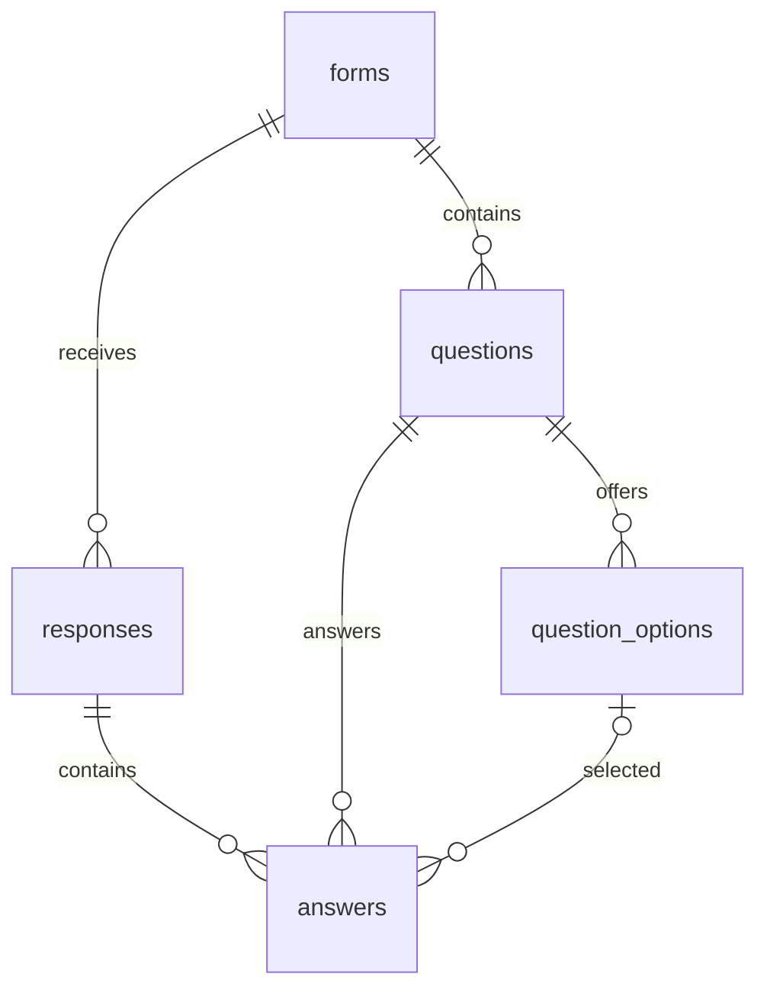

# Typeform Clone

An original Typeform-inspired application built for the **Scaler AI SDE Fullstack
Assignment**. A creator can build and publish a form, collect answers through a
conversational public experience, and review persisted responses and statistics.

## Features

- **Workspace:** searchable grid/list views; create, rename, duplicate, and delete
  forms; draft/published status and real response counts.
- **Builder:** inline question/title/help-text editing, required settings,
  editable choices, pointer and keyboard drag-and-drop ordering, and live
  desktop/mobile preview. Changes persist through the API.
- **Eight question types:** short text, long text, multiple choice, dropdown,
  email, number, yes/no, and rating.
- **Publishing:** stable public share links, clipboard feedback, and unpublishing.
- **Respondent experience:** full-screen, one question at a time; restrained
  transitions, progress, keyboard navigation, client/server validation,
  submission to SQLite, and a confirmed thank-you screen. No login is needed.
- **Results:** newest-first responses, full individual answers including skipped
  optional questions, local timestamps, answered counts, choice/dropdown/yes-no/
  rating distributions, percentages, and rating averages. Manual refresh.
- **Feedback:** loading, empty, and error states; accessible dialogs, menus, tabs,
  visible keyboard focus, and reduced-motion support.
- The builder keeps its primary workflow focused on question editing, preview,
  publishing, sharing, and results. Theme customization, branching, and external
  integrations are outside the assignment scope.

## Tech stack

| Layer | Tools used |
| --- | --- |
| Frontend | Next.js 16 App Router, React 19, TypeScript, Tailwind CSS 4 and original CSS |
| Interaction | dnd-kit, Framer Motion, Lucide React, Sonner, clsx |
| Validation | Typed frontend validators; Zod in the health-response helper |
| Backend | Python 3.12, FastAPI, Uvicorn, SQLAlchemy 2, Pydantic 2, pydantic-settings, email-validator |
| Persistence | SQLite, Alembic |
| Development | npm, uv, ESLint, pytest, httpx, Ruff |

Exact resolved versions are in `frontend/package-lock.json` and `backend/uv.lock`.
The repository retains its existing environment and dependency versions.

## Local setup

Prerequisites: **Node.js 24**, **Python 3.12**, and **uv**. Clone the repository,
then run the frontend and backend in separate terminals from the repository root.

Frontend:

```sh
cd frontend
npm install
npm run dev
```

Backend:

```sh
cd backend
uv sync
uv run alembic upgrade head
uv run python -m app.db.seed
uv run uvicorn app.main:app --reload
```

`uv` uses `backend/.venv`; manual virtual-environment creation is unnecessary.
Migrate before starting the API. Application startup and health checks do not
create tables.

| Local address | Purpose |
| --- | --- |
| http://localhost:3000 | Workspace and public frontend |
| http://localhost:8000/health | API health |
| http://localhost:8000/docs | Interactive API schemas and examples |

### Environment variables

Local defaults work without environment files. For overrides, copy
`backend/.env.example` to `backend/.env` and `frontend/.env.example` to
`frontend/.env.local`, then edit the copies. Keep real environment files out of Git.

| Variable | Default | Purpose |
| --- | --- | --- |
| `NEXT_PUBLIC_API_URL` | `http://localhost:8000` | Backend base URL used by browser requests; no `/api` suffix |
| `DATABASE_URL` | `sqlite:///./typeform_clone.db` | SQLAlchemy SQLite URL; relative paths resolve from `backend/` |
| `FRONTEND_ORIGIN` | `http://localhost:3000` | Exact frontend origin allowed by CORS; no trailing slash |
| `APP_NAME` | `Typeform Clone API` | API title, OpenAPI title, and health service name |
| `APP_ENV` | `development` | Environment label; it does not enable authentication or change database behavior |

The `.env.example` files are the source of truth. Restart after configuration
changes. Set `NEXT_PUBLIC_API_URL` **before building** the frontend; public
variables are embedded at build time and require a rebuild to change.

## Architecture

```text
frontend/src/
  app/                    Server Component routes and root layout
  components/             Shared buttons, status, menus, dialogs, and feedback
  features/forms/         Workspace and form management
  features/builder/       Question editor, ordering, settings, and preview
  features/respondent/    Public navigation, validation, answers, and submission
  features/results/       Response list/detail and question summaries
  lib/api/                Typed native-fetch API helpers
  types/                  Frontend domain/API contracts
backend/
  app/api/                Central router and transaction dependencies
  app/core/               Centralized pydantic-settings configuration
  app/db/                 Declarative Base, engines/sessions, and seed command
  app/models/             SQLAlchemy relationships and constraints
  app/schemas/            Pydantic request/response validation
  app/services/           Form/question/response/statistics business logic
  app/routes/             Thin FastAPI route handlers
  alembic/                Schema migrations
  tests/                  API, database, migration, and concurrency tests
```

Interactive frontend features are scoped Client Components; pages/layout remain
Server Components. React state is sufficient for local interactions. API helpers
use native fetch, cancellation, bounded request timeouts, and human-readable
errors. No polling, HTTP library, or global state-management framework is used.

SQLite connections enable foreign-key enforcement. Sessions are request-scoped.
Mutations use one transaction and commit once or roll back; SQLite writers acquire
`BEGIN IMMEDIATE` before validating state. This prevents publication, response
submission, and question edits from racing past history protection. Distributions
and response counts are computed from persisted rows.

Question text saves on blur. Type/options/required changes save immediately.
Pending saves are serialized, retaining newer local edits. Preview uses the
working form definition and never submits answers.

### Frontend routes

| Route | Purpose |
| --- | --- |
| `/` | Creator workspace |
| `/forms/[formId]` | Builder and preview |
| `/to/[slug]` | Published public respondent flow |
| `/forms/[formId]/results` | Responses and Summary tabs |
| `/forms/[formId]/results/[responseId]` | Full individual response |

## Database schema

| Table | Important columns and constraints |
| --- | --- |
| `forms` | Title, draft/published status, unique nullable public slug, created/updated timestamps; published forms require a slug |
| `questions` | Form FK, one of eight types, title, optional description, required flag, position, timestamps; unique `(form_id, position)` |
| `question_options` | Question FK, label, position, creation timestamp; unique `(question_id, position)` |
| `responses` | Form FK, UTC submission timestamp; index on `(form_id, submitted_at, id)` for newest-first retrieval |
| `answers` | Response/question FKs, optional option FK, text/number/boolean values, creation timestamp; unique `(response_id, question_id)` and exactly one stored value |



Deleting a form cascades to its questions, options, responses, and answers.
Question/option deletion cascades to their dependent rows. Service validation
also ensures every submitted question belongs to the form and every selected
option belongs to that exact question. Ordering is explicit and zero-based.
SQLite timestamps are exposed as UTC in API JSON and rendered in browser-local
time in Results. No database file is committed.

## API overview

Full schemas and interactive examples are available at `/docs`.

| Method | Route | Behavior |
| --- | --- | --- |
| GET | `/health` | Service status independent of database |
| GET / POST | `/api/forms` | List forms with counts / create draft |
| GET / PATCH / DELETE | `/api/forms/{id}` | Definition / rename / cascade delete |
| POST | `/api/forms/{id}/duplicate` | Fresh draft copy without responses or slug |
| POST | `/api/forms/{id}/publish` or `/unpublish` | Publication and stable public URL |
| POST | `/api/forms/{id}/questions` | Append a question |
| PATCH / DELETE | `/api/forms/{id}/questions/{questionId}` | Update / remove question |
| PUT | `/api/forms/{id}/questions/reorder` | Persist the complete question order |
| GET | `/api/public/forms/{slug}` | Published public definition |
| POST | `/api/public/forms/{slug}/responses` | Validate and persist a whole submission |
| GET | `/api/forms/{id}/responses` | Newest-first submissions including answers |
| GET | `/api/forms/{id}/responses/{responseId}` | One response with question text and option labels |
| GET | `/api/forms/{id}/statistics` | Total count and per-question counts/distributions |

Create/rename: `{"title":"Customer feedback"}`. Choice questions accept
`"options":[{"label":"Basic"},{"label":"Pro"}]`. Submit
`{"answers":[{"question_id":1,"value":"Jamie"}]}`; choice values use the option
IDs from the public definition. Omit unanswered optional questions.

Creation returns 201, deletion 204, missing resources 404, protected question
mutations 409, invalid data 422, and publishing an empty form 400.

## Migrations and seed data

Run from `backend/`:

```sh
uv run alembic upgrade head
uv run alembic current
uv run alembic check
uv run python -m app.db.seed
```

For future schema changes, import models through `app.models`, then run
`uv run alembic revision --autogenerate -m "describe change"`. Review the generated
migration before applying it. Current schema head: `e42a53e64a4a`.

The idempotent seed creates two published forms, each with three responses:
`sample-product-feedback` and `sample-event-survey`. Across them are all eight
question types. Existing samples are identified by slug and skipped, preserving
edits and collected responses. Seeding again does not duplicate data.

## Tests and checks

Frontend:

```sh
cd frontend
npm run lint
npm run build
npm audit --omit=dev
```

Backend:

```sh
cd backend
uv run ruff check .
uv run pytest
uv run alembic current
uv run alembic check
```

The 55 backend tests migrate isolated temporary SQLite databases and do not use
the developer database. Coverage includes CRUD, publication/history protection,
validation, all answer types, constraints/cascades, seed idempotence, transactional
ordering, concurrency, and migration downgrade/upgrade. Browser QA covers creator
and respondent workflows, Results, keyboard interaction, errors, and responsive
layouts; see [the requirement audit](docs/QA.md).

## Assumptions and known limitations

- One default creator; management and results endpoints have no authentication.
  This follows the assignment simplification and is intended for an evaluation
  deployment, not an authenticated multi-tenant service.
- Multiple choice and dropdown select one option. Rating is fixed at 1–5.
- Published forms and forms with responses have protected question definitions.
  Unpublish an unanswered form to edit it; duplicate a form with responses.
  Renaming and unpublishing remain available. Duplication omits submissions.
- Only completed submissions persist. Refresh restarts unfinished public answers;
  they are not stored in localStorage. Failed submissions retain answers on screen.
- Response listing returns all submissions without pagination. SQLite serializes
  writers; deployment uses one service instance with one local durable database.
- Theme customization, branching, integrations, CSV export, file upload, partial
  tracking, authentication, and dark mode are outside the current scope.
- The installed Starlette TestClient/httpx adapter emits a deprecation warning.
  Development-only npm advisories are separate from the production dependency audit.
- Browser QA uses Chrome with emulated viewport sizes; physical mobile-device and
  screen-reader testing have not been performed.

## Third-party resources and licenses

This implementation is original. **No Typeform source code, CSS, paid templates,
logos, or proprietary Typeform assets were copied or used.** Public
[Typeform documentation](https://help.typeform.com/hc/en-us/articles/360053660271-My-first-form)
was consulted only for layout and interaction references. The wordmark, form
covers, UI styles, and browser icon are original code/vector work.

The following license declarations were checked in installed package metadata,
with official sources for fonts and standalone tools:

| Resource | License |
| --- | --- |
| Next.js, React/React DOM, Tailwind CSS, dnd-kit, Framer Motion, Sonner, clsx, Zod | MIT |
| Lucide React package | ISC; some inherited Feather icons use MIT, as described in [Lucide's license](https://lucide.dev/license) |
| TypeScript | Apache-2.0 |
| ESLint and Next.js ESLint configuration | MIT |
| FastAPI, SQLAlchemy, Pydantic, pydantic-settings, Alembic, pytest, Ruff | MIT |
| Uvicorn, httpx | BSD-3-Clause |
| email-validator | Unlicense |
| [uv](https://github.com/astral-sh/uv#license) | MIT OR Apache-2.0 |
| [Python](https://docs.python.org/3/license.html) | PSF License Agreement and accompanying notices |
| [SQLite](https://www.sqlite.org/copyright.html) | Public domain |
| Geist / Geist Mono via `next/font` | [SIL Open Font License 1.1](https://github.com/vercel/geist-font/blob/main/OFL.txt); bundled notice at `frontend/public/licenses/geist-OFL.txt` |
| Next.js transitive sharp/native libvips packages | Apache-2.0 for sharp; LGPL-3.0-or-later for libvips, with combined notices for native binaries; retain their distributed license notices |
| Transitive caniuse-lite browser-support data | CC-BY-4.0; retain its attribution/license metadata |

All listed resources are free/open-source and usable under their stated terms.
Retain dependency/font license notices when distributing builds. The application
is an assignment clone, not an official Typeform product.

## Deployment

Public repository:
[Asceptic07/Scaler-AI-Typeform-Clone](https://github.com/Asceptic07/Scaler-AI-Typeform-Clone).
**Hosted demo: Pending deployment.**

The code supports separate frontend and backend origins. Deployment remains
pending; submission requires both the repository URL and a verified hosted demo
URL. No hosting provider or paid plan is required by the code.

### Frontend

Use a Next.js-capable host, for example Vercel, with project root `frontend/`,
Node 24, install command `npm ci`, and build command `npm run build`. Set
`NEXT_PUBLIC_API_URL=https://your-api.example` before building. For a regular Node
host, run `npm run start` after the build. Use HTTPS for both services.
[Public environment variables are included at build time](https://vercel.com/academy/nextjs-foundations/env-and-security).

### Backend and durable SQLite

Use a Python 3.12 host with uv and **a persistent local disk/volume**, such as a
single-instance VM, container host, or a service with a persistent disk. Set the
service root to `backend/` and install locked runtime dependencies with
`uv sync --frozen --no-dev`.

Configure:

```dotenv
APP_NAME=Typeform Clone API
APP_ENV=production
FRONTEND_ORIGIN=https://your-frontend.example
DATABASE_URL=sqlite:////var/data/typeform_clone.db
```

Mount a persistent disk at `/var/data`, ensure it is writable by the service, and
run migrations **where that mounted volume is available**:

```sh
uv run --frozen --no-dev alembic upgrade head
uv run --frozen --no-dev python -m app.db.seed
uv run --frozen --no-dev uvicorn app.main:app --host 0.0.0.0 --port "$PORT"
```

These are POSIX shell deployment commands; use the port assigned by the host
(or 8000 for a fixed-port host). On a host where the disk is only available at
runtime, chain migration/seed/start with `&&` in the service start command so a
failed migration prevents startup. Do not migrate the mounted database in an
isolated build step. Do not use `--reload` in production. Configure `/health` as
the health-check path, and keep one instance/worker for the assignment deployment.

Local SQLite persists normally. Many free services provide ephemeral filesystems:
restarts or deploys may destroy a database written there. A durable hosted SQLite
installation **requires** a persistent disk, plus SQLite-aware backups outside
that disk. Render is one possible backend host, but its documentation says disks
are attached to paid services; its default filesystem is ephemeral. See
[Render's disk documentation](https://render.com/docs/disks) before choosing a plan.
Other providers or a VM with durable storage are equally valid. SQLite is retained
as required by the assignment.

After hosting, verify CORS using the exact frontend origin, both sample public
links, a new submission, Results, and persistence across backend restart/redeploy.
Submit the public repository URL above and the verified demo URL after deployment.
